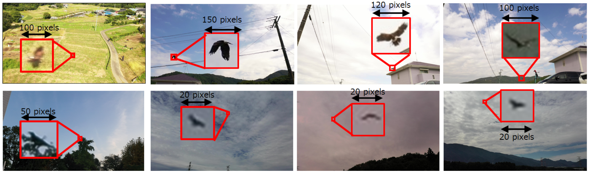

# Distant Bird Detection Dataset for Safe Drone Flight

In this work, we propose a large dataset of bird detections captured by a drone camera at valious locations (e.g., fields, mountains, and near houses).



## 

For the safe flight of drones, they must avoid the attacks of aggressive birds. These birds move very fast and must be detected far enough away. In recent years, deep learning has made it possible to detect small distant objects in RGB camera images. Since these methods are learning-based, they require a large amount 
of training images, but there are no publicly-available datasets for bird detection taken from drones. In this work, we propose a new dataset captured by a drone camera. 

## Dataset overview
Our dataset 
* contains 62,106 manually annotated bird instances in 48395 images with a resolution of 3840 × 2160 pixels.
* is devided into 42,790 training images with 52,036 instances and 5,605 validation images with 10,070 instances.
* have 3 object labels (i.e., hawk, crow, and wild bird.)

## Annotation format


```yaml
[
    {
        'path': file_path,
        'bbox': [
            [x1, y1, w1, h1],
            [x2, y2, w2, h2],
        ]
        'label': [
            'label1',
            'label2',
        ]
    }
    ...
]
```

## Data access

### Images
[Images](https://drive.google.com/file/d/10_gyG5GQLNRX89SUuSG1xy8MSUlbNwzv/view?usp=sharing)

[train]() | [val]()

## Citation
If you are using our dataset, please add a reference to our [paper](http://www.mva-org.jp/Proceedings/2021/papers/O1-1-3.pdf?fbclid=IwAR2CwkCVoLEDIfAUxhSzPnA44QYXR5MkJzevGsACb7zFX9hI216z1TinCME).

```
@inproceedings{,
  title={Distant Bird Detection for Safe Drone Flight and Its Dataset},
  author={Sanae, Fujii and Kazutoshi, Akita and Ukita, Norimichi},
  booktitle={International Conference on Machine Vision Applications (MVA)},
  year={2021}
}
```
